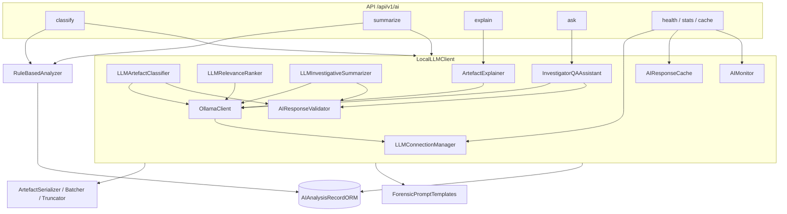

# DFAT AI Engine

Local-first LLaMA-3 triage for DFAT Stage 3. Structured JSON remains the
authoritative evidential record; LLM narratives are advisory (Scanlon et al.,
2023).

## Component diagram

## Prompt templates

| Template | Purpose | Notes |
|----------|---------|--------|
| classification | Batch classify artefacts by suspicion | Compact serialisation; discard unknown IDs |
| ranking | Relevance scores merged with rules | `0.4 * llm + 0.6 * rule` |
| summary | Five-section investigative narrative | Validated into `SummaryResult` |
| explanation | Per-artefact forensic explanation | Cached by artefact/prompt |
| qa | Investigator natural-language Q&A | Optional conversation history via chat |

All templates share `PROMPT_VERSION` (ADR-019). System prompt
`FORENSIC_SYSTEM_PROMPT` forbids fabrication and requires `[UNCERTAIN]` tags.

## Confidence scoring

`ConfidenceScorer` adjusts scores based on:

- Reasoning length and specificity
- Presence of valid artefact ID references
- IOC indicators
- Hallucinated ID penalties
- Summary section completeness

Scores are advisory metadata for UI and monitoring — never chain-of-custody
evidence.

## Hallucination mitigation

See ADR-018. Pipeline:

1. Parse structured JSON; drop unknown artefact IDs.
2. Run `HallucinationGuard` on free-text answers.
3. Attach `HallucinationReport` (`risk_level`, `clean_response`).
4. Log detections via `AIMonitor` (metadata only).

## Caching behaviour

`AIResponseCache` (LRU + TTL) keys on `SHA-256(prompt + model + temperature)`:

- Hits avoid redundant local inference for identical prompts
- Temperature/model changes miss
- Admin endpoints expose stats and clear (`DELETE /api/v1/ai/cache`)
- Audit logs must never contain prompt or evidence bodies

## Fallback

When Ollama is unhealthy or `use_fallback=true`:

- `RuleBasedAnalyzer` / `RuleBasedTriageEngine` produces deterministic rankings
- Template summaries omit LLM narrative enrichment
- Always available (`is_available() == True`) — ADR-020 / ADR-016

## API surface

| Method | Path | Auth |
|--------|------|------|
| POST | `/api/v1/ai/classify` | `analysis:create` |
| POST | `/api/v1/ai/summarize` | `analysis:create` |
| POST | `/api/v1/ai/explain/{artefact_id}` | `analysis:create` |
| POST | `/api/v1/ai/ask` | `analysis:create` |
| GET | `/api/v1/ai/health` | none |
| GET | `/api/v1/ai/stats` | admin |
| GET | `/api/v1/ai/cache/stats` | admin |
| DELETE | `/api/v1/ai/cache` | admin |

Classification and other AI ops persist telemetry in `ai_analysis_records`.

## Known limitations

- Uses **base LLaMA-3**, not a domain-fine-tuned ForensicLLM variant
  (Sharma et al., 2025). Fine-tuning is a documented future improvement.
- Narrative quality depends on local hardware and model variant.
- Hallucination guards are heuristic; investigators must verify against
  structured JSON.
- Local-only constraint (ADR-017 / ADR-002) requires on-prem Ollama.

## Related ADRs

- ADR-002 / ADR-017 — local LLM only
- ADR-006 / ADR-016 / ADR-020 — rule-based triage / fallback
- ADR-018 — hallucination mitigation
- ADR-019 — prompt versioning
- ADR-003 — dual-output JSON authority

